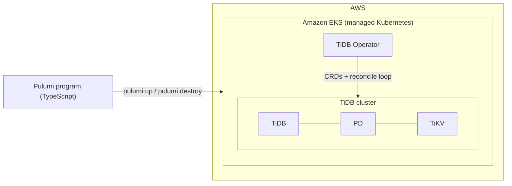

# Lab 1: Deploy a TiDB Cluster on AWS EKS

This lab deploys a **TiDB cluster** on **Amazon EKS**, a managed Kubernetes
service. The cluster is managed by **TiDB Operator**, and the whole deployment
process is automated with **Pulumi**, an infrastructure-as-code (IaC) framework.

| | |
|:--|:--|
| **Tech stack** | AWS EKS · Kubernetes · TiDB Operator · TiDB · Pulumi (TypeScript) · Helm |
| **Scoring** | 100 basic points + 20 bonus points = **120 points** in total |
| **Handout** | [Lab slides (PDF)](./VLDB%20ss%202023%20lab%201.pdf) · [Lab slides (PPTX)](./VLDB%20ss%202023%20lab%201.pptx) |

## Contents

- [Introduction](#introduction)
- [Architecture at a Glance](#architecture-at-a-glance)
- [Learning Objectives](#learning-objectives)
- [Prerequisites](#prerequisites)
- [Lab Roadmap](#lab-roadmap)
- [Quick Start](#quick-start)
- [Important Notes](#important-notes)
- [AWS Billing](#aws-billing)

## Introduction

**Cloud computing** is the delivery of computing services — including servers,
storage, databases, networking, software, analytics, and intelligence — over
the internet ("the cloud"), to offer faster innovation, flexible resources, and
economies of scale as your business needs change.

**Amazon EKS** is a managed Kubernetes service that makes it easy to run
**Kubernetes** on AWS. Kubernetes automates the deployment, scaling, and
management of containerized applications.

**TiDB** is an open-source distributed SQL database that supports HTAP
(Hybrid Transactional and Analytical Processing) workloads. It provides a
one-stop database solution and helps improve the scalability, availability,
and reliability of your data storage systems.

Deploying TiDB clusters on AWS EKS gives you all the features provided by
TiDB, while also leveraging the benefits of a managed Kubernetes service.

## Architecture at a Glance



1. You define the desired infrastructure in **Pulumi programs** and run
   `pulumi up`.
2. Pulumi creates the **EKS cluster** on AWS, then deploys **TiDB Operator**
   and the **TiDB cluster** into it.
3. **TiDB Operator** keeps the TiDB cluster in the desired state through the
   Kubernetes operator (reconcile) pattern.

## Learning Objectives

- Understand the basic usage of Kubernetes
- Understand the basic usage of the AWS managed Kubernetes service (EKS)
- Understand the fundamentals of the operator pattern
- Learn to deploy TiDB clusters on Kubernetes with TiDB Operator
- Understand the basic usage of a TiDB cluster
- Automate the deployment process with the Pulumi IaC framework

## Prerequisites

| Requirement | Details |
|:--|:--|
| **AWS account** | With an IAM access key ID and secret access key |
| **Network** | VPN access to the AWS API and GitHub, if required in your region |
| **Operating system** | Linux, macOS, or WSL2 |
| **CLI tools** | `kubectl`, Node.js 16 (via nvm), AWS CLI, Pulumi, and Helm — see [Step 0](./0-install-dependencies/README.md) |

## Lab Roadmap

> 100 basic points + 20 bonus points = **120 points** in total.

| # | Step | What you will do | Points |
|:-:|:--|:--|:-:|
| 0 | [Install dependencies](./0-install-dependencies/README.md) | Create your own repository from the template, then install `kubectl`, Node.js 16, AWS CLI, Pulumi, and Helm | — |
| 1 | [Create an EKS cluster](./1-create-an-eks-cluster/README.md) | Learn the basics of Kubernetes and Pulumi, then create an EKS cluster with `pulumi up` | 25 |
| 2 | [Deploy TiDB with TiDB Operator](./2-deploy-tidb-with-tidb-operator/README.md) | Learn the operator pattern (CRD + reconcile loop), then deploy TiDB Operator and a TiDB cluster | 25 |
| 3 | [Explore TiDB basic usage](./3-explore-tidb-basic-usage/README.md) | Port-forward to TiDB, TiDB Dashboard, and Grafana; access TiDB via the MySQL client and run SQL | 20 |
| 4 | [Scale up the TiDB cluster](./4-scale-up-tidb-cluster-with-tidb-operator/README.md) | Scale TiKV from 1 to 2 replicas by editing the manifest and re-applying it with Pulumi | 20 |
| 5 | [Cleanup: destroy the EKS cluster](./1-create-an-eks-cluster/README.md#do-not-execute-this-step-until-lab-1-finished-destroy-the-eks-cluster-via-pulumi) | **Only after finishing the whole lab**: destroy the cluster via Pulumi to release resources and stop billing | 10 |
| B | [Bonus: config the slow-log threshold](./%5Bbonus%5Dconfig-slow-log-threshold/README.md) | Adjust the TiDB slow-log threshold and update the cluster with Pulumi | +20 |

## Quick Start

```bash
# 1. Create your own repository from the lab template:
#    https://github.com/vldbss-2023/lab1-deploy-tidb-cluster-on-aws-eks

# 2. Clone YOUR repository and install the dependencies
git clone https://github.com/<your-github-name>/lab1-deploy-tidb-cluster-on-aws-eks
cd lab1-deploy-tidb-cluster-on-aws-eks
make install

# 3. Follow the steps in order, starting from Step 0 in the table above
```

## Important Notes

> [!IMPORTANT]
> Steps 2–4 must run in **the same shell session** as Step 1. If you have
> closed the shell, reload the kubeconfig first:
>
> ```bash
> export KUBECONFIG=$PWD/../1-create-an-eks-cluster/kubeconfig.yaml
> ```

> [!WARNING]
> The lab keeps incurring AWS charges until the cluster is destroyed. After you
> finish everything (including the bonus), go back to
> [Step 5: Cleanup](./1-create-an-eks-cluster/README.md#do-not-execute-this-step-until-lab-1-finished-destroy-the-eks-cluster-via-pulumi)
> and destroy the cluster.

## AWS Billing

This lab incurs the following charges on your AWS account:

| Item | Quantity | Unit price | Subtotal |
|:--|:-:|:--|--:|
| EKS cluster control plane | 1 | $0.10 / hour | $0.1000 / hour |
| EC2 `t2.medium` worker nodes | 2 | $0.0464 / hour each | $0.0928 / hour |
| EBS volumes (1 GiB each) | 4 | negligible | ≈ $0 |
| **Total** | | | **$0.1928 / hour** |

> [!TIP]
> Destroying the cluster at the end (Step 5) stops all of these charges.
